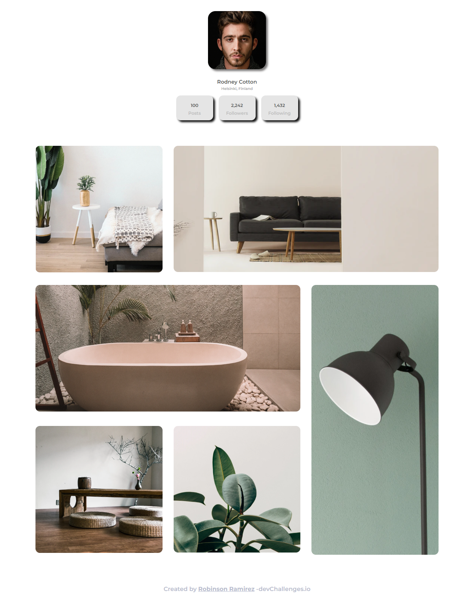

<!-- Please update value in the {}  -->

<h1 align="center">My-Gallery-Master</h1>

   Solution for a challenge from  <a href="https://devchallenges.io/challenges/gcbWLxG6wdennelX7b8I" target="_blank">Devchallenges.io</a>.

  <h3>
    <a href="https://glittery-croquembouche-7d4321.netlify.app/">
      Demo
    </a>
     | 
    <a href="https://github.com/robin1040/My-gallery-master">
      Solution
    </a>
     | 
    <a href="https://devchallenges.io/challenges/gcbWLxG6wdennelX7b8I">
      Challenge
    </a>
  </h3>

<!-- TABLE OF CONTENTS -->

## Table of Contents

- [Overview](#overview)
  - [Built With](#built-with)
- [Features](#features)
- [Contact](#contact)
- [Acknowledgements](#acknowledgements)

<!-- OVERVIEW -->

## Overview

Introduce your projects by taking a screenshot or a gif. Try to tell visitors a story about your project by answering:

- Where can I see your demo?
The site demo it's [here](https://jolly-kilby-b27ff7.netlify.app/)
- What was your experience?
I use Bootstrap to make this project and Use some Own CSS too, Adobe illustrator to make the Spoon and Knife icon after use icomoon to make the font to use it.
- What have you learned/improved?
Bootstrap 4.
Bootstrap Flex.
Adobe Illustrator
Icomoon
CSS Position
- Your wisdom? :)
Better use of Bootstrap and illustrator and traslate a svt to icon font.

### Built With

<!-- This section should list any major frameworks that you built your project using. Here are a few examples.-->

- [HTML & CSS]
-[Adobe Illustrator]
- Deployed with [Netlify](https://www.netlify.com/)

## Features

<!-- List the features of your application or follow the template. Don't share the figma file here :) -->

This application/site was created as a submission to a [DevChallenges](https://devchallenges.io/challenges) challenge. The [challenge](https://devchallenges.io/challenges/OEKdUZ6xs0h99C38XVht) was to build an application to complete the given user stories.

## Acknowledgements

<!-- This section should list any articles or add-ons/plugins that helps you to complete the project. This is optional but it will help you in the future. For exmpale -->

- [Steps to replicate a design with only HTML and CSS](https://devchallenges-blogs.web.app/how-to-replicate-design/)
- [Bootstrap](https://getbootstrap.com/docs/4.6/getting-started/introduction/)
- [Creating and Implementing Your Own Icon Font – A Tutorial](https://mediatemple.net/blog/design-creative/creating-implementing-icon-font-tutorial/)

## Contact

- GitHub [@robin1040](https://github.com/robin1040)
- Facebook [@robin1040](https://www.facebook.com/robinson.estiven.5/)